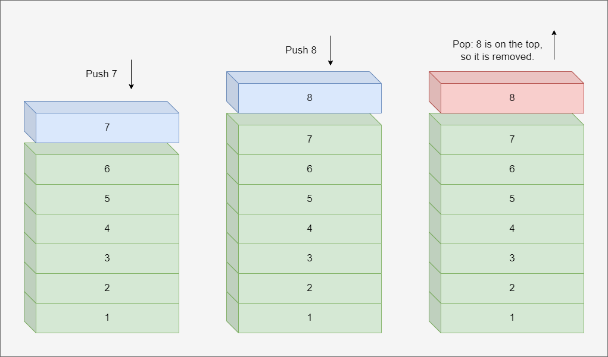

# STL Stack Tutorial

## Overview
A stack is a data structure where a new element is introduced at the top and an element is deleted from that end exclusively, giving it an LIFO (Last In First Out) approach. Stack employs an enclosed object of either vector, deque, or list. This document will go into detail about how it functions and what scenarios it might be useful in.

## How does it work?
Before we cover implementation, it's neccessary to further define how exactly a stack works. It might help to visualize it as a stack of books. When an book is introduced to the stack, it's placed on top. When a book is removed, it's taken from the top. In programming, these actions are called "push" and "pop". 

Below is a diagram to help you visualize this process.




When an item is introduced through "push", it's added to the top of the stack. When an item is deleted through "pop", the last element that was added is taken away.

When using stack in C++ STL, first you need to but the header file in the code.

```
#include <stack>
```
Next, to define the stack, we use this syntax:
```
template <class Type, class Container = deque<Type> > class stack;
```
### Syntax Explanation:
- Type: This is the type of the elements in the stack; it can be any type that exists in C++ including user-defined types.
- Container: This is the type of the underlying container.

### Member types:
- value_type: This is the first parameter in the syntax, "Type".
- container_type: This is the second paramter, "Container".
- size_type: This is an insigned integral type.

### Stack Operations:
- Push: This operation adds or pushes an item onto the stack.
- Pop: This operation pops or removes a stack item.
- Peek: Without deleting it, returns the top item in the stack.
- isFull: Determines if a stack is full.
- isEmpty: Determines if a stack is empty.

### Other Functions:
- empty(): Determines if a stack is empty or not.
- size(): Yields the size of the stack, or the number of stack items.
- top(): Retrieves the top-most stack element.

Finally, we'll use the above information to play around with STL Stack in a program.
```
#include <iostream>
#include <stack>
using namespace std;

int main() {
	stack<int> S;

	for(int i = 0; i < 10; i++)
		S.push(i);

	cout << "stack size: " << S.size() << endl;
	cout << "top of stack: " << S.top() << endl;
	cout << endl;
	
	S.pop();
	cout << "new stack size: " << S.size() << endl;
	cout << "new top of stack: " << S.top() << endl;
}
```
```
Output: 

stack size: 10
top of stack: 9

new stack size: 9
new top of stack: 8
```


## How is this data structure useful?
Stack is useful in many scenarios. A simple example that most people are familar with is the undo function in many applications, like text editors or drawing programs. 

Using a text editor as an example, each change counts as a stack element. When the undo function is used, the most recent element added will be "popped", or removed.


## Further Reading

https://www.geeksforgeeks.org/stack-data-structure/

https://www.geeksforgeeks.org/stack-in-cpp-stl/

https://cplusplus.com/reference/stack/stack/

https://youtu.be/WK97Pj0wa7A

